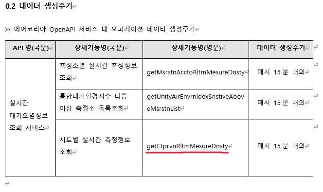
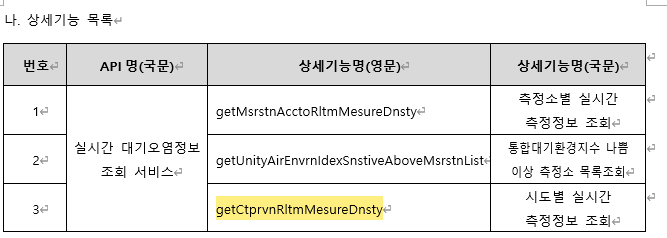
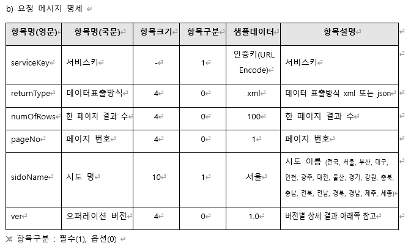
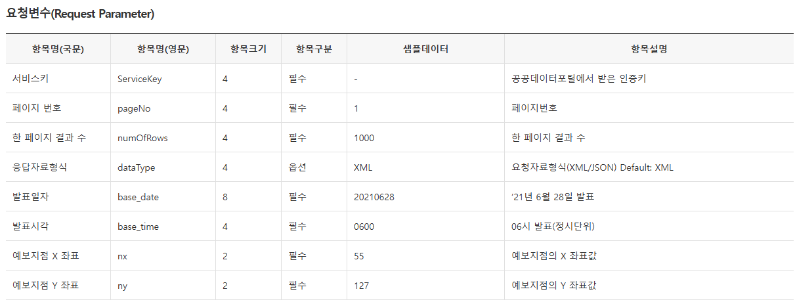

# suwon finedust
수원시 미세먼지 분석 및 예측

---

### 주제 선정 이유 및 분석 목표
- 환기 시킬 때 미세먼지 확인하기 귀찮음
<hr>

- 수원시 구별로 실시간 **미세먼지** 농도와 **날씨 정보**를 함께 수집
- 이를 기반으로 향후 미세먼지 농도 **예측**
- **API**와 **머신러닝**을 사용하고 싶었는데 적합한 주제였음

---

### 근데

지금 모델은 못 만들고 API 받아와서 지도 시각화하는 거까지 밖에 못 만듦
> 나중에 모델까지 만들어서 발표하든 뭘하든 하겠음

---

### 주요 파일 구조

```
├── config.py             # 설정 파일 (API 키, 좌표, 등급 기준)
├── data_collector.py     # 데이터 수집 및 병합 로직
├── visualizer.py         # 지도 시각화
├── main.py               # 전체 실행 흐름
├── scheduler.py          # 스케줄링 실행
├── data/                 # CSV 저장 폴더
├── maps/                 # 생성된 지도 저장 폴더
```

---

```python
# 수원 각 구의 위도/경도
DISTRICT_COORDINATES = {
  '장안구': (37.3099, 127.0129),
  ...
}

# PM10/PM2.5 등급 기준 및 색상
PM10_GRADE = {'좋음': (0, 30.9), ...}
GRADE_COLORS = {'좋음': '#32CD32', ...}
```

- 지도 표시 기준이 되는 미세먼지 등급과 색상 정의
- 위치 데이터를 기상청 API 호출에 사용

---

### data_collector.py - 개요

- **실시간 미세먼지**: AirKorea API
- **실시간 날씨**: 기상청 초단기 실황 API
- 구별 데이터를 모아 병합 후 DataFrame 반환

---

### Air Korea api 활용하기

<br>
<br>




---

### Air Korea api 활용하기



---

### Air Korea api 활용하기

```python
url = f"{self.airkorea_base_url}/getCtprvnRltmMesureDnsty"
params = {
    'serviceKey': config.AIRKOREA_API_KEY,
    'returnType': 'json',
    'numOfRows': '100',
    'pageNo': '1',
    'sidoName': '경기',
    'ver': '1.0'
}

res = requests.get(url, params=params)
```

---

### Air Korea api 활용하기

```python
def get_air_quality_data(self):
    ...
    # 각 구별 측정소 평균값 추출
    grouped = df.groupby(['district', 'timestamp']).agg({
        'pm10': 'mean',
        'pm25': 'mean'
    }).reset_index()
```

- 측정소별 pm10, pm25 수치 → 구 단위 평균
- timestamp 단위로 정리

---

### 기상청 api 활용하기



---

### 기상청 api 활용하기

```python
nx, ny = latlon_to_xy(lat, lon)
url = f"{self.weather_base_url}/getUltraSrtNcst"
params = {
    'serviceKey': config.WEATHER_API_KEY,
    'numOfRows': '100',
    'pageNo': '1',
    'dataType': 'JSON',
    'base_date': base_date,
    'base_time': base_time,
    'nx': nx,
    'ny': ny
}
res = requests.get(url, params=params)
```

---

### 기상청 api 활용하기

```python
def get_weather_data(self, air_timestamp=None):
    ...
    if item['category'] == 'T1H':
        info['temperature'] = float(item['obsrValue'])
```

- 기온(T1H), 습도(REH), 풍속(WSD) 수집
- 위경도 → 격자 좌표 변환(latlon_to_xy 함수)

---

### 병합 및 반환

```python
def collect_and_merge_data(self):
    air_df = self.get_air_quality_data()
    weather_df = self.get_weather_data()
    
    merged_df = pd.merge(
        air_df, weather_df, 
        on=['district', 'timestamp'],
        how='inner'
    )
```

- 같은 시간대, 같은 구에 대해 미세먼지 + 날씨 데이터 병합

---

### main.py - 데이터 저장

```python
def update_data():
    ...
    # 중복 제거 후 CSV 저장
    current_data = pd.concat([...])
    current_data.drop_duplicates()
    save_to_csv(current_data, 'historical_data.csv')
```

- 병합된 데이터는 `data/historical_data.csv`에 저장
- 기존 데이터와 병합해서 누적 저장됨

---

### visualizer.py

```python
folium.CircleMarker(
    location=[lat, lon],
    color=self.pm10_to_color(pm10),
    popup=popup_text
).add_to(m)
```

- 가장 최근 데이터를 바탕으로 folium으로 지도 생성
- PM10 수치에 따라 색상 변경
- 등급도 함께 출력됨

---

### scheduler.py

```python
schedule.every(1).minutes.do(job)
```

- 일정 주기로 데이터 수집
- 발표 시 테스트용으로 1분마다 실행
- 실제 운영에서는 매시 20분 자동 수집으로 변경 가능

---

### 결과물 예시

- `maps/latest_map.html`로 지도 저장됨
- 각 구의 PM10 등급에 따라 색상 구분
- CircleMarker로 시각적으로 표현

🟢 좋음 / 🟡 보통 / 🟠 나쁨 / 🔴 매우나쁨

---

<!-- _class: lead -->
# 시현 함 슥 해주기

---

<!-- _class: lead -->
# 코드 설명

---

<!-- _class: lead -->
# Q&A